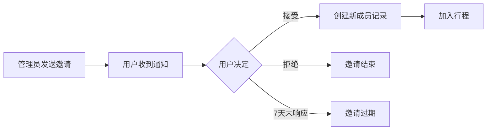
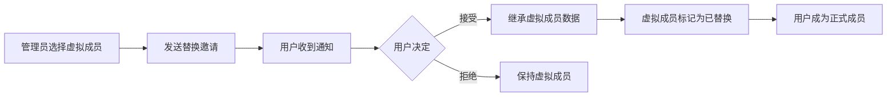

# 邀请系统 API 文档

## 概述

邀请系统允许行程管理员邀请其他注册用户加入行程。支持两种邀请类型：添加新成员（ADD）和替换虚拟成员（REPLACE）。所有邀请都有有效期限制，并通过消息系统实时通知被邀请用户。

## 系统特点

- **双模式邀请**: 支持添加新成员和替换虚拟成员
- **权限控制**: 仅管理员可发送邀请
- **实时通知**: WebSocket推送邀请通知
- **防重复机制**: 自动检测重复邀请
- **过期管理**: 7天自动过期机制
- **状态追踪**: 完整的邀请状态流转

## 邀请类型

| 类型 | 说明 | 使用场景 |
|------|------|---------|
| ADD | 添加新成员 | 邀请新用户加入行程 |
| REPLACE | 替换虚拟成员 | 将虚拟成员替换为真实用户，保留历史记录 |

## 邀请状态

```
PENDING（待处理）
    ├── ACCEPTED（已接受）→ 用户加入行程
    ├── REJECTED（已拒绝）→ 邀请结束
    ├── CANCELLED（已取消）→ 发送方取消
    └── EXPIRED（已过期）→ 7天后自动过期
```

## API 接口

### 1. 用户搜索

搜索注册用户以发送邀请。

**GET** `/users/search`

#### 请求头

```
Authorization: Bearer <token>
```

#### 查询参数

| 参数 | 类型 | 必填 | 说明 |
|------|------|------|------|
| q | string | 是 | 搜索关键词（用户名或邮箱） |
| excludeTripId | string | 否 | 排除已在该行程中的用户 |
| limit | number | 否 | 返回数量限制，默认10 |

#### 响应示例

```json
{
  "success": true,
  "data": [
    {
      "id": "user-uuid-1",
      "username": "张三",
      "email": "zhangsan@example.com",
      "avatarUrl": "https://example.com/avatar1.jpg"
    },
    {
      "id": "user-uuid-2",
      "username": "李四",
      "email": "lisi@example.com",
      "avatarUrl": null
    }
  ]
}
```

### 2. 发送邀请

向指定用户发送行程邀请。

**POST** `/trips/:tripId/invitations`

#### 请求头

```
Authorization: Bearer <token>
```

#### 路径参数

| 参数 | 类型 | 说明 |
|------|------|------|
| tripId | string | 行程ID |

#### 请求体

```json
{
  "invitedUserId": "user-uuid",
  "inviteType": "ADD",
  "message": "一起来玩吧！",
  "replaceMemberId": null
}
```

#### 参数说明

| 参数 | 类型 | 必填 | 说明 |
|------|------|------|------|
| invitedUserId | string | 是 | 被邀请用户ID |
| inviteType | string | 是 | 邀请类型：ADD/REPLACE |
| message | string | 否 | 邀请留言，最多200字符 |
| replaceMemberId | string | 条件必填 | 当inviteType为REPLACE时必填 |

#### 响应示例

```json
{
  "success": true,
  "data": {
    "id": "inv-uuid",
    "tripId": "trip-uuid",
    "inviterId": "user-uuid-admin",
    "invitedUserId": "user-uuid",
    "inviteType": "ADD",
    "message": "一起来玩吧！",
    "status": "PENDING",
    "expiresAt": "2025-09-18T10:00:00Z",
    "createdAt": "2025-09-11T10:00:00Z",
    "trip": {
      "name": "北京五日游",
      "startDate": "2025-10-01",
      "endDate": "2025-10-05"
    },
    "inviter": {
      "username": "王五",
      "email": "wangwu@example.com"
    }
  }
}
```

### 3. 获取行程邀请列表

获取指定行程的所有邀请记录（仅管理员）。

**GET** `/trips/:tripId/invitations`

#### 请求头

```
Authorization: Bearer <token>
```

#### 查询参数

| 参数 | 类型 | 必填 | 说明 |
|------|------|------|------|
| status | string | 否 | 状态筛选：PENDING/ACCEPTED/REJECTED/CANCELLED/EXPIRED |
| page | number | 否 | 页码，默认1 |
| limit | number | 否 | 每页数量，默认20 |

#### 响应示例

```json
{
  "success": true,
  "data": {
    "invitations": [
      {
        "id": "inv-uuid-1",
        "invitedUserId": "user-uuid-1",
        "inviteType": "ADD",
        "status": "PENDING",
        "expiresAt": "2025-09-18T10:00:00Z",
        "invitedUser": {
          "username": "张三",
          "email": "zhangsan@example.com"
        }
      },
      {
        "id": "inv-uuid-2",
        "invitedUserId": "user-uuid-2",
        "inviteType": "REPLACE",
        "status": "ACCEPTED",
        "replaceMemberId": "member-uuid",
        "replaceMember": {
          "displayName": "李四（虚拟）"
        },
        "acceptedAt": "2025-09-11T12:00:00Z",
        "invitedUser": {
          "username": "李四",
          "email": "lisi@example.com"
        }
      }
    ],
    "pagination": {
      "page": 1,
      "limit": 20,
      "total": 5,
      "totalPages": 1
    }
  }
}
```

### 4. 获取我的邀请

获取当前用户收到的所有邀请。

**GET** `/invitations`

#### 请求头

```
Authorization: Bearer <token>
```

#### 查询参数

| 参数 | 类型 | 必填 | 说明 |
|------|------|------|------|
| status | string | 否 | 状态筛选 |
| includeExpired | boolean | 否 | 是否包含过期邀请，默认false |
| page | number | 否 | 页码 |
| limit | number | 否 | 每页数量 |

#### 响应示例

```json
{
  "success": true,
  "data": {
    "invitations": [
      {
        "id": "inv-uuid",
        "tripId": "trip-uuid",
        "inviteType": "ADD",
        "message": "一起来玩吧！",
        "status": "PENDING",
        "expiresAt": "2025-09-18T10:00:00Z",
        "trip": {
          "id": "trip-uuid",
          "name": "北京五日游",
          "description": "国庆假期北京游",
          "startDate": "2025-10-01",
          "endDate": "2025-10-05",
          "memberCount": 5
        },
        "inviter": {
          "username": "王五",
          "email": "wangwu@example.com",
          "avatarUrl": "https://example.com/avatar.jpg"
        }
      }
    ],
    "pagination": {
      "page": 1,
      "limit": 20,
      "total": 3,
      "totalPages": 1
    }
  }
}
```

### 5. 获取邀请详情

获取单个邀请的详细信息。

**GET** `/invitations/:id`

#### 请求头

```
Authorization: Bearer <token>
```

#### 路径参数

| 参数 | 类型 | 说明 |
|------|------|------|
| id | string | 邀请ID |

#### 响应示例

```json
{
  "success": true,
  "data": {
    "id": "inv-uuid",
    "tripId": "trip-uuid",
    "inviterId": "user-uuid-admin",
    "invitedUserId": "user-uuid",
    "inviteType": "REPLACE",
    "message": "你是李四吗？帮我们记录一下之前的费用",
    "status": "PENDING",
    "replaceMemberId": "member-uuid",
    "expiresAt": "2025-09-18T10:00:00Z",
    "createdAt": "2025-09-11T10:00:00Z",
    "trip": {
      "id": "trip-uuid",
      "name": "北京五日游",
      "description": "国庆假期北京游",
      "startDate": "2025-10-01",
      "endDate": "2025-10-05",
      "initialFund": 10000,
      "currency": "CNY",
      "members": [
        {
          "id": "member-uuid-1",
          "username": "王五",
          "role": "admin"
        },
        {
          "id": "member-uuid-2",
          "displayName": "李四",
          "isVirtual": true,
          "role": "member"
        }
      ]
    },
    "inviter": {
      "id": "user-uuid-admin",
      "username": "王五",
      "email": "wangwu@example.com"
    },
    "replaceMember": {
      "id": "member-uuid",
      "displayName": "李四",
      "contribution": 1000,
      "balance": -500
    }
  }
}
```

### 6. 接受邀请

接受行程邀请，自动加入行程或替换虚拟成员。

**POST** `/invitations/:id/accept`

#### 请求头

```
Authorization: Bearer <token>
```

#### 路径参数

| 参数 | 类型 | 说明 |
|------|------|------|
| id | string | 邀请ID |

#### 响应示例

```json
{
  "success": true,
  "data": {
    "message": "邀请已接受，您已加入行程",
    "tripId": "trip-uuid",
    "memberId": "member-uuid-new"
  }
}
```

### 7. 拒绝邀请

拒绝行程邀请。

**POST** `/invitations/:id/reject`

#### 请求头

```
Authorization: Bearer <token>
```

#### 路径参数

| 参数 | 类型 | 说明 |
|------|------|------|
| id | string | 邀请ID |

#### 请求体（可选）

```json
{
  "reason": "时间冲突，无法参加"
}
```

#### 响应示例

```json
{
  "success": true,
  "data": {
    "message": "邀请已拒绝"
  }
}
```

### 8. 取消邀请

取消已发送的邀请（仅发送者或管理员）。

**DELETE** `/invitations/:id`

#### 请求头

```
Authorization: Bearer <token>
```

#### 路径参数

| 参数 | 类型 | 说明 |
|------|------|------|
| id | string | 邀请ID |

#### 响应示例

```json
{
  "success": true,
  "data": {
    "message": "邀请已取消"
  }
}
```

## 邀请流程

### 添加新成员流程（ADD）



### 替换虚拟成员流程（REPLACE）



## WebSocket 事件

### 接收事件

```javascript
// 收到新邀请
socket.on('invitation_received', (invitation) => {
  console.log('收到行程邀请:', invitation)
  // 显示邀请通知
  showNotification({
    title: '新的行程邀请',
    body: `${invitation.inviter.username}邀请您加入「${invitation.trip.name}」`,
    actions: ['查看详情', '稍后处理']
  })
})

// 邀请被接受（发送者收到）
socket.on('invitation_accepted', (data) => {
  console.log('邀请已被接受:', data)
  // 刷新成员列表
  refreshMemberList(data.tripId)
})

// 邀请被拒绝（发送者收到）
socket.on('invitation_rejected', (invitationId) => {
  console.log('邀请已被拒绝:', invitationId)
})
```

## 使用示例

### 示例1：完整的邀请流程

```javascript
// 1. 搜索用户
const searchResults = await fetch('/api/users/search?q=张三&excludeTripId=trip-123')
const users = await searchResults.json()

// 2. 发送邀请
const invitation = await fetch('/api/trips/trip-123/invitations', {
  method: 'POST',
  headers: {
    'Content-Type': 'application/json',
    'Authorization': 'Bearer <token>'
  },
  body: JSON.stringify({
    invitedUserId: users.data[0].id,
    inviteType: 'ADD',
    message: '一起来北京玩吧！'
  })
})

// 3. 被邀请者查看邀请
const myInvitations = await fetch('/api/invitations?status=PENDING')

// 4. 接受邀请
await fetch(`/api/invitations/${invitationId}/accept`, {
  method: 'POST'
})
```

### 示例2：替换虚拟成员

```javascript
// 1. 获取虚拟成员列表
const members = await fetch('/api/trips/trip-123/members')
const virtualMembers = members.data.filter(m => m.isVirtual)

// 2. 搜索对应的真实用户
const user = await searchUserByName(virtualMembers[0].displayName)

// 3. 发送替换邀请
await fetch('/api/trips/trip-123/invitations', {
  method: 'POST',
  body: JSON.stringify({
    invitedUserId: user.id,
    inviteType: 'REPLACE',
    replaceMemberId: virtualMembers[0].id,
    message: '你是李四吗？这是你之前的消费记录'
  })
})
```

## 错误处理

| 错误码 | 说明 | 处理建议 |
|--------|------|----------|
| 400 | 参数错误 | 检查请求参数 |
| 401 | 未授权 | 检查登录状态 |
| 403 | 权限不足 | 仅管理员可发送邀请 |
| 404 | 资源不存在 | 邀请或用户不存在 |
| 409 | 冲突 | 用户已在行程中或已有待处理邀请 |
| 422 | 业务逻辑错误 | 查看具体错误信息 |

### 常见错误示例

```json
{
  "success": false,
  "error": {
    "code": "409",
    "message": "该用户已经是行程成员"
  }
}
```

```json
{
  "success": false,
  "error": {
    "code": "422",
    "message": "该用户已有待处理的邀请"
  }
}
```

## 注意事项

1. **权限控制**: 只有行程管理员才能发送邀请
2. **防重复**: 系统自动检测并阻止重复邀请
3. **有效期**: 邀请7天后自动过期，需要重新发送
4. **替换限制**: 替换虚拟成员后，原虚拟成员的所有数据将转移给真实用户
5. **通知机制**: 所有邀请操作都会通过消息系统和WebSocket通知相关用户
6. **并发控制**: 同一用户同时只能有一个待处理的邀请

---
*最后更新: 2025-09-11*  
*版本: v2.0.0*